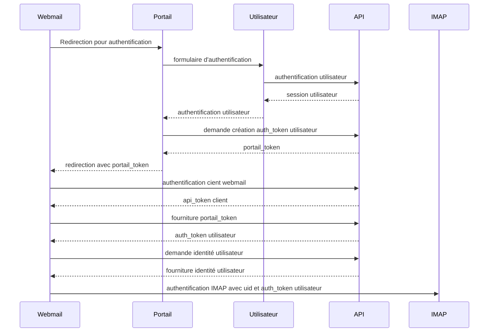

[toc]

# Introduction

Le plugin `mi_auth` permet l'authentification des utilisateurs et boites fonctionnelles à Roundcube en passant par le `portail utilisateur` développé par le MIOM. Ainsi, l'authentification se fait via le `portail utilisateur` qui redirige vers le webmail.

# Dépendances

Du fait que le plugin ne réalise pas directement d'authentification, il est dépendant de deux autres systèmes :

* Le portail utilisateur, développé par le MIOM : gère les authentification et incorpore le menu du portail pour la navigation vers les applications qui y sont définies
* L'API des gestion de mot de passe, développée par le MIOM
* le plugin mi_larry pour l'affichage des erreurs potentielles

Séquence d'authentification :



# Configuration

## Configuration générale

Dans le fichier de configuration général de roundcube :

* Ajouter `mi_auth` **après** `mi_larry`
* Retirer : `mel_ldap_auth`, `mi_oidc` (si présent) => ils ne servent pas avec `mi_auth` et surchargent inutilement Roundcube dans ce cas. Egalemnt, `mel_sondage` peut être supprimé : il est intégré par le portail utilisateur en surimpression sur le webmail, évitant de l'iframe posant des bugs dans certains cas.

## Configuration du plugin mi_auth

Exemple du `config.inc.php` :

```php
<?php
$config = [];
$config['mi_auth'] = [
  'client_id' => 'webmail',
  'client_secret' => 'test',
  'portail_uri' => "/testapi/",
  'api_uri' => "https://10.228.147.192/api/v1/",
  'auth_endpoint' => "auth/client",
  'auth_user_endpoint' => "auth/user",
  'portail_endpoint' => "portail/token",
  'userinfo_endpoint' => "pwd/user/info",
  //optional. Add parameters for requests for guzzle connexion
  'requests' =>  [
    'http_errors' => false,
    'verify' => false, //verify TLS signature
//    'proxy' => [ //add proxy access if needed
//      'http' => 'http://10.228.245.134:80', //for http access
//      'https' => 'http://10.228.245.134:80', //for https access
//      'no' => ['.minint.fr', 'rc01', 'https://10.228.174.192'], //list to not use proxy
//    ],
    'timeout' => 20.0, //timeout before error 408
    'curl' => [
      //CURLOPT_SSL_CIPHER_LIST => 'DEFAULT@SECLEVEL=1', //needed for Passage 2 minint
    ],
  ],
];
```

**Eléments importants** :

* `client_id` et `client_secret` : doivent être configurés dans l'API de gestion des mots de passe également. Permet au webmail de s'authentifier sur l'API pour réaliser les actions dont les scopes définis pour lui l'autorisent.
* `portail_uri` : url d'accès au portail. **Attention** : si le `hostname` est le même que celui du webmail, indiquer uniquement le `path` d'accès au portail.
* `api_uri` : url d'accès au webmail. **Note** : S'agissant d'un accès serveur à serveur, l'url publique n'est pas nécessaire, évitant probablement une configuration du proxy dans `requests`.
